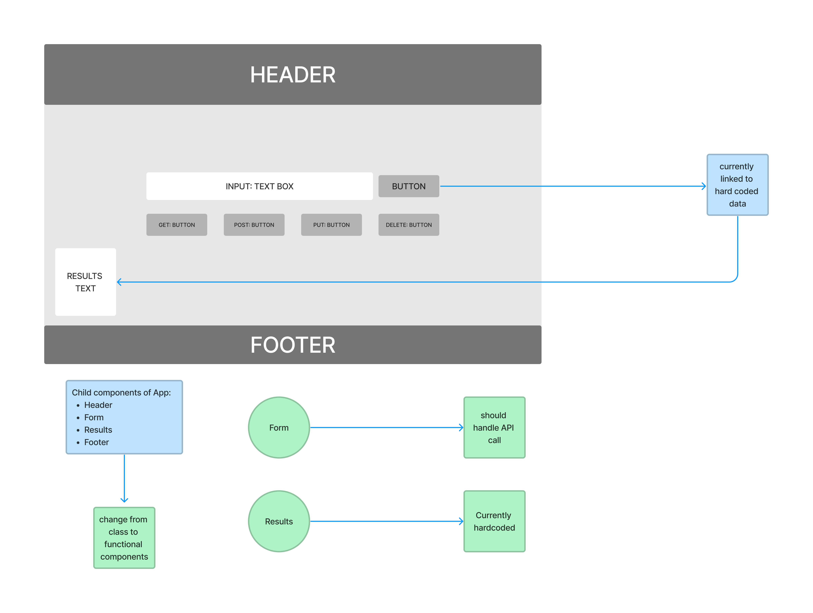

# restY app

## Author: Stephanie Hill

## Lab Class 26

- We currently have a react app that displays a header, footer and form center page.
- In this developmental phase, the go button only displays hard-coded data
- In future versions the form will be linked to standard API REST functionality and be able to retrieve data for the user
- Our major accomplishment in this phase of development was converting all of our class components to functional components.

Stay tuned for future updates!

## Lab 27

- We have added functionality!
- Users please input an API URL of your choosing into the text field
- Select any of the rest methods below
- Press GO! and see the results displayed (API functionality permitting)

## Lab 28

- We can now target the headers in our API data!
- We also have a text area to input JSON data for your PUT & POST requests!
- All responses are formatted in pretty pretty JSON too, for your viewing pleasure

### Links

- [Sandbox](https://codesandbox.io/p/github/stephnitis/resty/main?file=%2Fsrc%2FApp.js&workspace=%257B%2522activeFileId%2522%253A%2522cl9ncr70d000clrjmf6crhel3%2522%252C%2522openFiles%2522%253A%255B%2522%252FREADME.md%2522%255D%252C%2522sidebarPanel%2522%253A%2522EXPLORER%2522%252C%2522gitSidebarPanel%2522%253A%2522COMMIT%2522%252C%2522sidekickItems%2522%253A%255B%257B%2522key%2522%253A%2522cl9ncs38l000k3b6h1z7e848g%2522%252C%2522type%2522%253A%2522PROJECT_SETUP%2522%252C%2522isMinimized%2522%253Afalse%257D%252C%257B%2522type%2522%253A%2522PREVIEW%2522%252C%2522taskId%2522%253A%2522start%2522%252C%2522port%2522%253A3000%252C%2522key%2522%253A%2522cl9ncs38l000l3b6hhdlprzgf%2522%252C%2522isMinimized%2522%253Afalse%257D%255D%257D)
